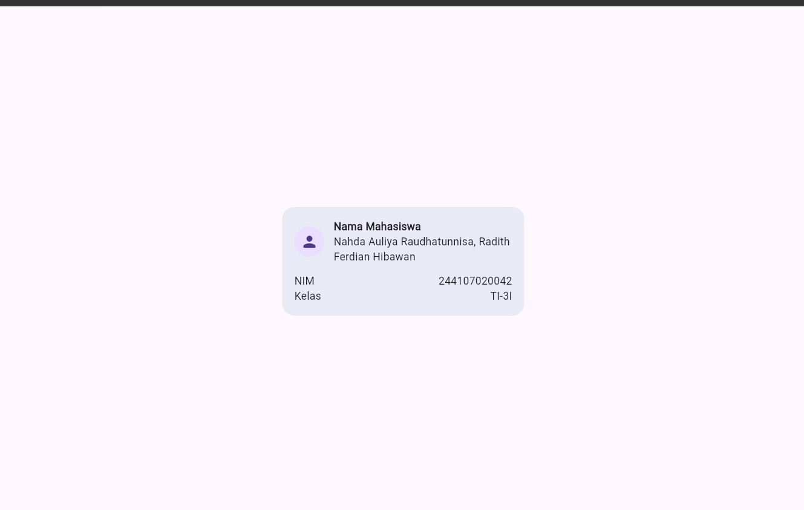
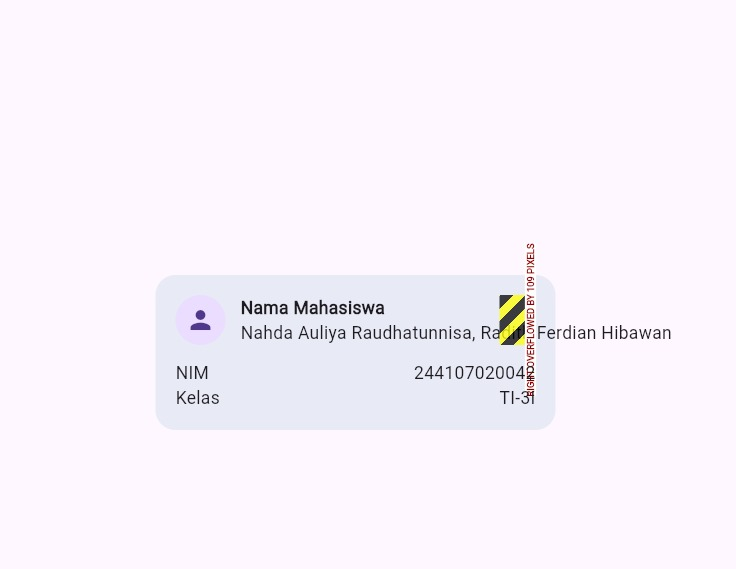
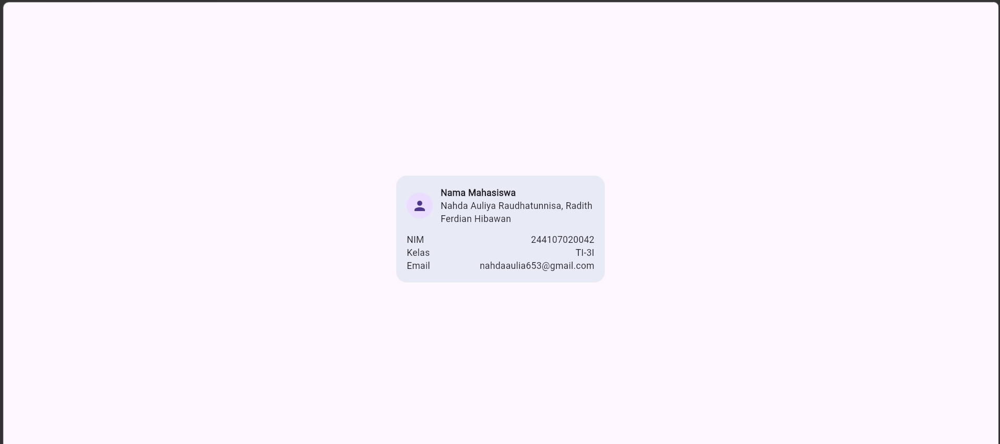

## 4. Praktikum: layout sederhana (warm-up)
### Eksperimen warm-up

**1. Hapus Expanded pada baris nama, lalu amati peringatan overflow atau perilaku layout-nya; kembalikan setelah itu.**

Jawaban: Setelah Expanded dihapus, Column yang berisi nama tidak lagi menggunakan ruang yang tersedia secara flexible.

**2. Ganti mainAxisSize: MainAxisSize.min menjadi nilai default dan amati perubahan tinggi kartu.**

*Jawaban:* Setelah mainAxisSize dijadikan nilai default. Column akan menggunakan ruang vertikal yang tersedia. Sedangkan jika menggunakan mainAxisSize, maka tinggi column akan menyesuaikan dengan kebutuhan size.

**3. Tambahkan satu baris data (misal Email) menggunakan pola Row + Expanded yang sama.**

## 5. Praktikum: dashboard responsif
