## 4. Praktikum: layout sederhana (warm-up)
### Eksperimen warm-up


**1. Hapus Expanded pada baris nama, lalu amati peringatan overflow atau perilaku layout-nya; kembalikan setelah itu.**


Jawaban: Setelah Expanded dihapus, Column yang berisi nama tidak lagi menggunakan ruang yang tersedia secara flexible.

**2. Ganti mainAxisSize: MainAxisSize.min menjadi nilai default dan amati perubahan tinggi kartu.**


*Jawaban:* Setelah mainAxisSize dijadikan nilai default. Column akan menggunakan ruang vertikal yang tersedia. Sedangkan jika menggunakan mainAxisSize, maka tinggi column akan menyesuaikan dengan kebutuhan size.

**3. Tambahkan satu baris data (misal Email) menggunakan pola Row + Expanded yang sama.**


## 5. Praktikum: dashboard responsif
**Menyiapkan project**

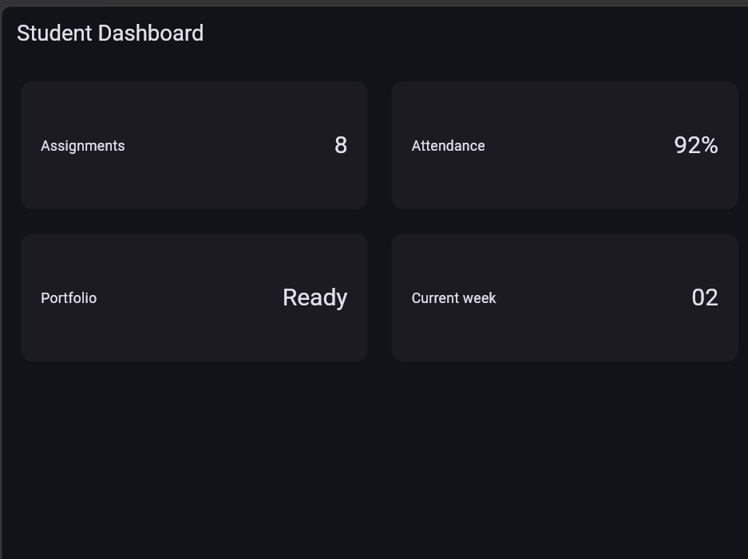

**Menambahkan interaksi: StatefulWidget dan Cupertino**

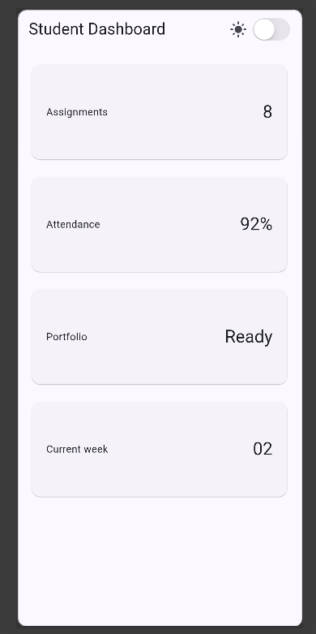
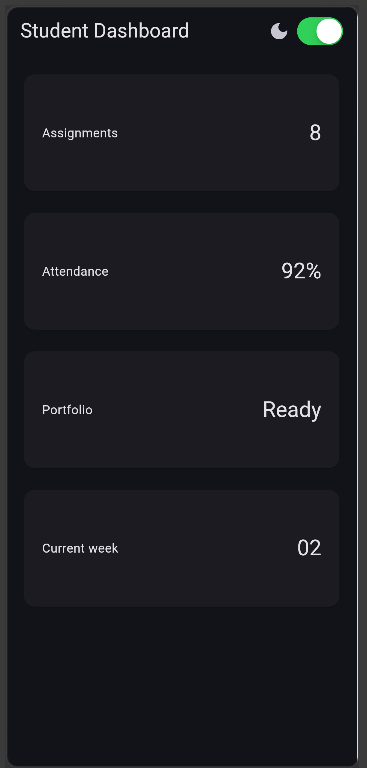


## Eksperimen Layout

### 1. Ubah breakpoint dari 700 menjadi nilai lain dan amati perubahan jumlah kolom.

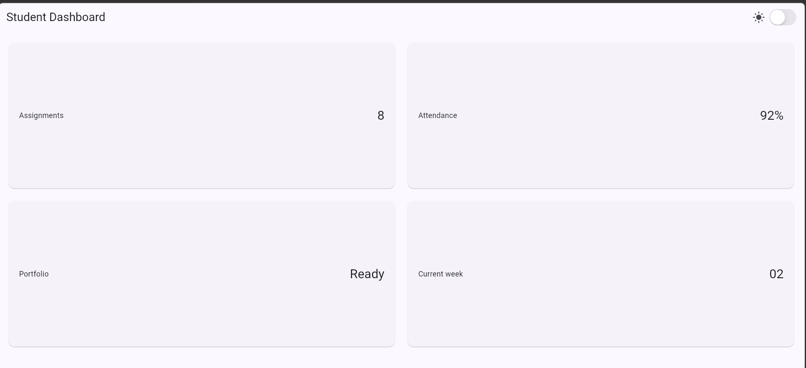


Terdapat perubahan pada ukuran kolom. Karena, lebar layar awalnya 700 px dirubah menjadi 900 px. Jadi semakin besar nilai breakpoint, semakin lebar layar yang dibutuhkan untuk menampilkan 2 kolom.

### 2. Ubah themeMode menjadi ThemeMode.dark, lalu kembalikan ke ThemeMode.system.

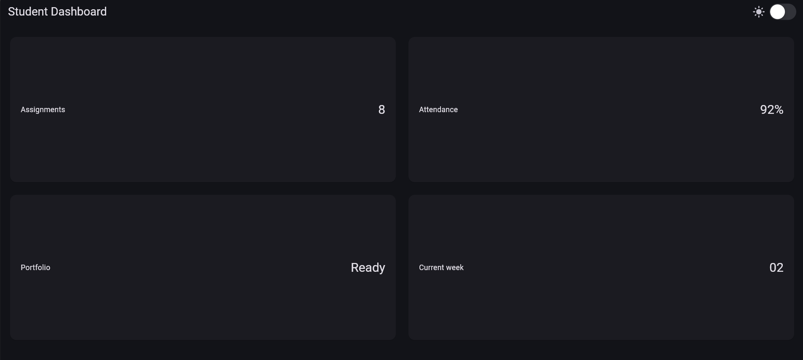

mode light tidak terdeteksi, karena hanya memakai mode gelap.

### 3. Uji aplikasi dengan ukuran layar emulator yang berbeda.

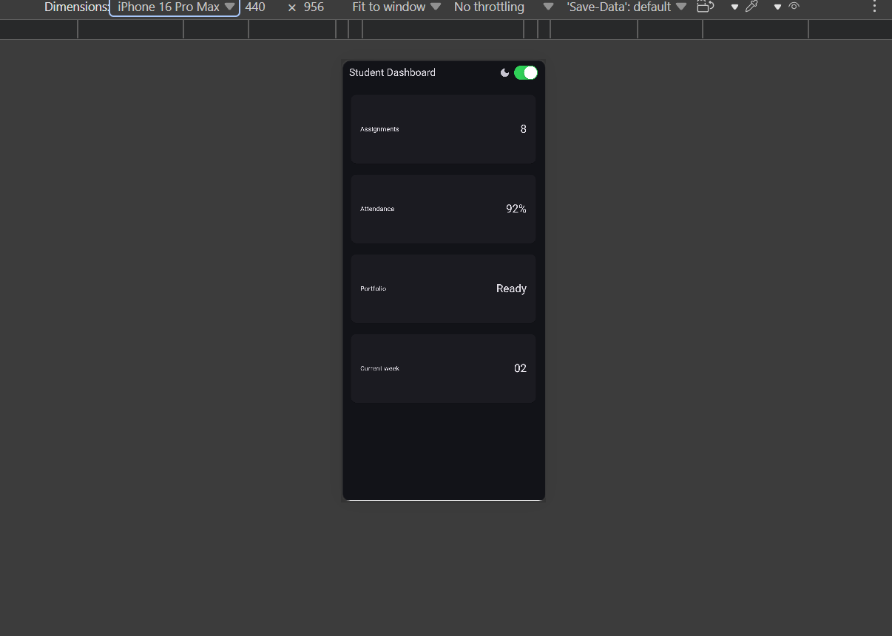

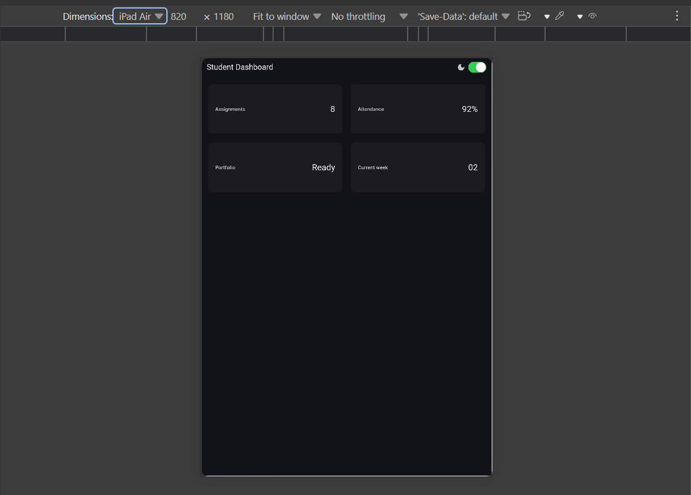

### 4. Tambahkan Semantics atau label yang bermakna pada elemen yang penting bagi screen reader.

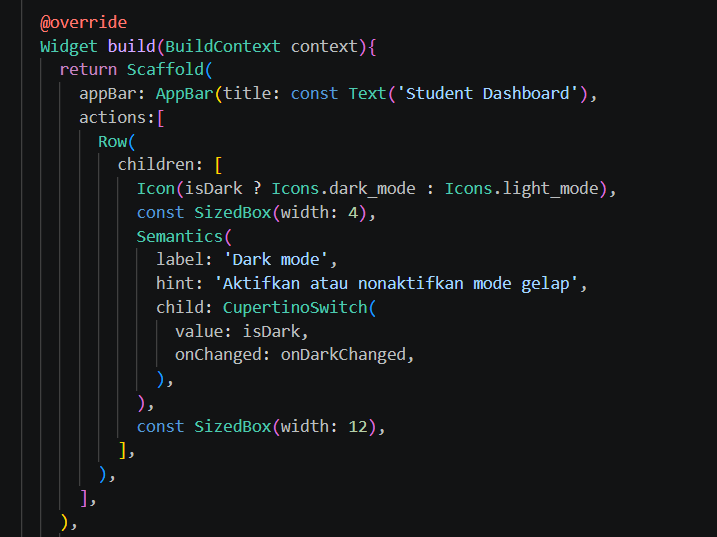

## 6. Tugas dan AI design exploration
### Tugas utama


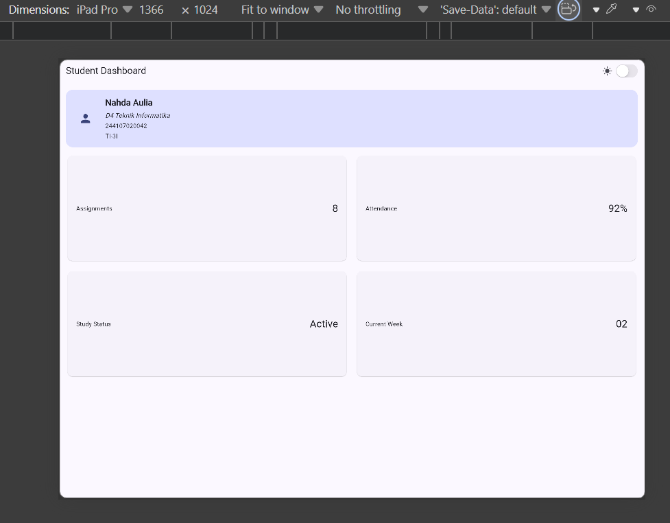

# AI Prompt Challenge – Responsive Academic Dashboard

## 1. Prompt Desain

### Prompt

> Bandingkan dua tata letak dashboard akademik untuk Flutter: versi `GridView` dan versi `LayoutBuilder` + `Column`. Jelaskan trade-off responsif dan aksesibilitasnya.

### Output Penting AI

**GridView**

`GridView` cocok untuk menampilkan banyak kartu dalam bentuk grid. Widget ini memiliki kemampuan scrolling dan dapat digunakan dengan `crossAxisCount` untuk menentukan jumlah kolom.

**Kelebihan:**

* Cocok untuk dashboard dengan banyak kartu.
* Mendukung scrolling.
* Mudah membuat susunan beberapa kolom.
* Struktur kode relatif sederhana.

**Kekurangan:**

* Jika jumlah kolom dibuat secara tetap, layout dapat kurang fleksibel pada berbagai ukuran layar.
* Pengaturan ukuran kartu perlu diperhatikan agar tidak terjadi layout yang terlalu sempit.

**LayoutBuilder + Column**

`LayoutBuilder` dapat digunakan untuk membaca ukuran ruang yang tersedia, kemudian menentukan layout berdasarkan breakpoint.

**Kelebihan:**

* Lebih fleksibel untuk responsive design.
* Dapat menentukan perubahan layout berdasarkan lebar layar.
* Cocok untuk menggabungkan header profil dengan dashboard cards.

**Kekurangan:**

* Struktur kode lebih kompleks.
* Developer harus menentukan breakpoint dan menguji beberapa ukuran layar.

### Keputusan

Saya memilih menggunakan **`LayoutBuilder + Column` dengan `GridView.count` di dalamnya**.

Alasannya adalah dashboard memiliki dua bagian utama, yaitu profile header dan kumpulan kartu informasi. `Column` digunakan untuk menyusun profile header dan dashboard secara vertikal, sedangkan `LayoutBuilder` digunakan untuk menentukan jumlah kolom berdasarkan lebar layar.

Breakpoint yang digunakan adalah **700px**:

```dart
final columns = constraints.maxWidth >= 700 ? 2 : 1;
```

Dengan demikian:

* Lebar < 700px → 1 kolom
* Lebar ≥ 700px → 2 kolom

Pendekatan ini lebih sesuai dengan kebutuhan dashboard karena tetap mempertahankan struktur profile header dan dapat menyesuaikan jumlah kolom berdasarkan ukuran layar.

---

## 2. Prompt Penguatan Konsep

### Prompt

> Jelaskan kapan penggunaan `Expanded` justru menyebabkan overflow di dalam `Row`, beri contoh kode yang gagal dan perbaikannya.

### Output Penting AI

`Expanded` bekerja dengan mengambil ruang yang tersedia di dalam `Row` atau `Column`. Masalah dapat terjadi ketika isi `Expanded` sendiri membutuhkan ruang yang lebih besar daripada ruang yang tersedia, terutama ketika terdapat widget dengan ukuran minimum atau ukuran tetap yang terlalu besar.

Contoh yang dapat menyebabkan masalah:

```dart
Row(
  children: [
    Expanded(
      child: Text(
        'Teks yang sangat panjang sekali dan tidak dapat menyesuaikan ukuran layar',
      ),
    ),
    Container(
      width: 500,
      child: Text('Data'),
    ),
  ],
)
```

Container dengan lebar tetap 500px dapat mengambil terlalu banyak ruang sehingga `Expanded` tidak mendapatkan ruang yang cukup.

Perbaikannya dapat dilakukan dengan menghindari ukuran tetap yang terlalu besar atau membuat bagian tersebut ikut fleksibel.

Contoh:

```dart
Row(
  children: [
    Expanded(
      child: Text(
        'Teks yang panjang',
        overflow: TextOverflow.ellipsis,
      ),
    ),
    const SizedBox(width: 8),
    Flexible(
      child: Text('Data'),
    ),
  ],
)
```

### Penerapan pada Project

Pada project ini, `Expanded` digunakan pada dashboard card:

```dart
Row(
  children: [
    Expanded(
      child: Text(title),
    ),
    Text(value),
  ],
)
```

Penggunaan tersebut aman karena `Expanded` digunakan untuk memberikan sisa ruang kepada judul card, sedangkan nilai card memiliki ukuran yang relatif kecil.

Saya juga menggunakan `Expanded` pada `Column`:

```dart
Expanded(
  child: LayoutBuilder(
    builder: (context, constraints) {
      ...
    },
  ),
)
```

Tujuannya adalah agar `GridView` menggunakan ruang yang tersisa setelah profile header ditampilkan.

---

## 3. Verification Prompt

### Prompt

> Periksa kembali rekomendasi layout di atas: apakah tetap responsif di bawah 600px, apakah mengurangi aksesibilitas, dan apakah ada widget yang tidak tersedia di Flutter stabil saat ini?

### Hasil Verifikasi

Berdasarkan implementasi yang digunakan:

### Responsiveness

Layout diuji menggunakan breakpoint:

```dart
final columns = constraints.maxWidth >= 700 ? 2 : 1;
```

Pada layar di bawah 600px, kondisi tersebut menghasilkan:

```text
columns = 1
```

sehingga kartu ditampilkan dalam satu kolom.

Pada layar yang lebih lebar dari 700px:

```text
columns = 2
```

sehingga kartu ditampilkan dalam dua kolom.

### Accessibility

Aksesibilitas tidak dihilangkan. Widget penting diberikan `Semantics`.

Contoh toggle:

```dart
Semantics(
  label: 'Dark mode',
  hint: 'Aktifkan atau nonaktifkan mode gelap',
  child: CupertinoSwitch(
    value: isDark,
    onChanged: onDarkChanged,
  ),
)
```

Dashboard card juga memiliki label:

```dart
Semantics(
  label: '$title: $value',
  child: Card(
    ...
  ),
)
```

Dengan demikian screen reader dapat memperoleh informasi yang lebih bermakna mengenai elemen tersebut.

### Widget Flutter

Widget yang digunakan dalam implementasi adalah widget Flutter yang umum tersedia, antara lain:

* `MaterialApp`
* `Scaffold`
* `AppBar`
* `Container`
* `Column`
* `Row`
* `Expanded`
* `GridView`
* `Card`
* `Semantics`
* `CupertinoSwitch`

`CupertinoSwitch` berasal dari:

```dart
import 'package:flutter/cupertino.dart';
```

Tidak ada widget eksperimental atau widget pihak ketiga yang digunakan.

---

## 4. Bukti Pengujian

### Pengujian Layar Sempit

Ukuran layar dibuat kurang dari 700px.

Hasil yang diharapkan:

```text
Profile Header

Assignments
Attendance
Portfolio
Current Week
```

Kartu tersusun dalam **1 kolom**.

Screenshot:

`screenshots/narrow.png`

### Pengujian Layar Lebar

Ukuran layar dibuat 700px atau lebih.

Hasil yang diharapkan:

```text
Assignments    Attendance

Portfolio      Current Week
```

Kartu tersusun dalam **2 kolom**.

Screenshot:

`screenshots/wide.png`

### Pengujian Dark Mode

Toggle `CupertinoSwitch` diuji dengan dua kondisi:

* Switch OFF → Light Theme
* Switch ON → Dark Theme

Teks dan kartu tetap dapat dibaca pada kedua mode.

### Pengujian Accessibility

`Semantics` ditambahkan pada:

1. Toggle dark mode
2. Dashboard cards

Tujuannya agar informasi penting dapat dikenali oleh screen reader.

---

## 5. Kesimpulan

Berdasarkan perbandingan dan verifikasi, implementasi yang dipilih adalah **`LayoutBuilder + Column` dengan `GridView` untuk kartu dashboard**.

Pendekatan ini dipilih karena dapat menggabungkan profile header dengan dashboard cards serta memungkinkan perubahan jumlah kolom berdasarkan ukuran layar.

Implementasi juga mempertahankan aksesibilitas menggunakan `Semantics` dan menyediakan light theme serta dark theme melalui `CupertinoSwitch`.

Hasil pengujian menunjukkan bahwa layout menggunakan satu kolom pada layar sempit dan dua kolom pada layar lebar. Dengan demikian, implementasi memenuhi kebutuhan responsive dashboard dan dapat digunakan pada berbagai ukuran layar.


## Refactoring Challenge
1. Ekstrak kartu informasi menjadi widget reusable
Kartu informasi dibuat menjadi widget InfoCard yang menerima parameter title dan value. Dengan demikian, tidak perlu menuliskan struktur kartu yang sama berulang kali.

2. Menggunakan Theme.of(context)
Warna dan style yang berkaitan dengan tampilan tidak lagi ditentukan secara langsung pada setiap widget. Sebagai gantinya, digunakan Theme.of(context) sehingga tampilan dapat mengikuti light theme maupun dark theme

3. Memusatkan breakpoint ke satu konstanta
Breakpoint untuk menentukan layout satu atau dua kolom dipindahkan menjadi satu konstanta. Dengan demikian, nilai breakpoint hanya didefinisikan satu kali. Jika breakpoint ingin diubah, cukup mengubah nilai kWideBreakpoint tanpa perlu mencari dan mengubah angka breakpoint di beberapa bagian kode.

4. 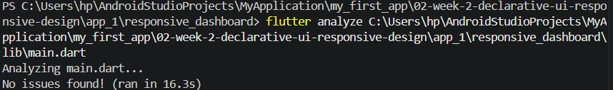


## Testing Dasar

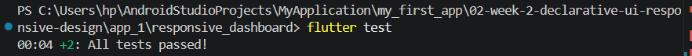

# 7. Refleksi dan referensi

## Refleksi
1.  Apa perbedaan cara berpikir imperative dan declarative saat membangun UI? 
Jawaban: Imperative menjelaskan langkah-langkah untuk membangun atau mengubah UI, sedangkan declarative menjelaskan kondisi atau tampilan yang diinginkan. Flutter menggunakan pendekatan declarative melalui widget dan build().
- Kapan Expanded membantu dan kapan penggunaannya justru menghasilkan layout error?
jawaban: Expanded membantu ketika ingin widget mengisi sisa ruang dalam Row atau Column. Namun, jika digunakan pada parent dengan ukuran yang tidak terbatas atau ruang yang tidak mencukupi, dapat menyebabkan overflow atau layout error.
- Bagaimana breakpoint dan theme memengaruhi pengalaman pengguna?
Jawaban: Breakpoint membuat UI menyesuaikan ukuran layar. Pada dashboard, layar sempit menggunakan 1 kolom, sedangkan layar lebar menggunakan 2 kolom. Theme membuat tampilan dapat menyesuaikan light dan dark mode sehingga lebih nyaman digunakan.
- Apa yang Anda verifikasi dari rekomendasi AI setelah tugas inti selesai?,
Jawaban: Saya memverifikasi rekomendasi AI dengan menjalankan aplikasi dan melakukan pengujian responsive layout, penggunaan Expanded, accessibility dengan Semantics, serta menjalankan flutter test. Saat ditemukan error Too many elements, saya menganalisis penyebabnya dan memperbaiki test agar memilih card tertentu.