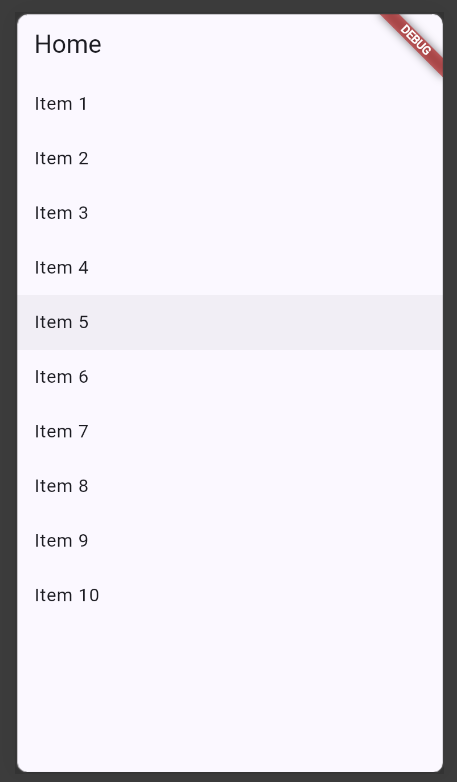
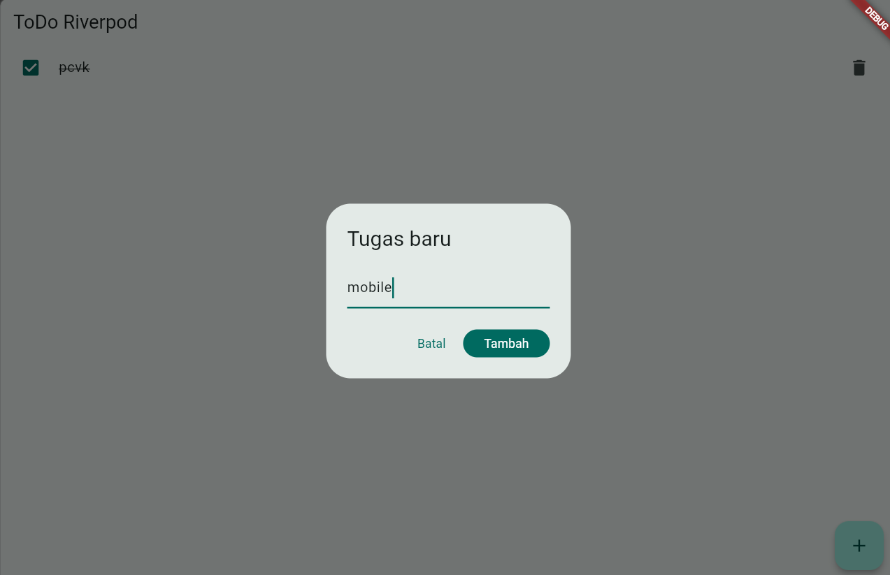
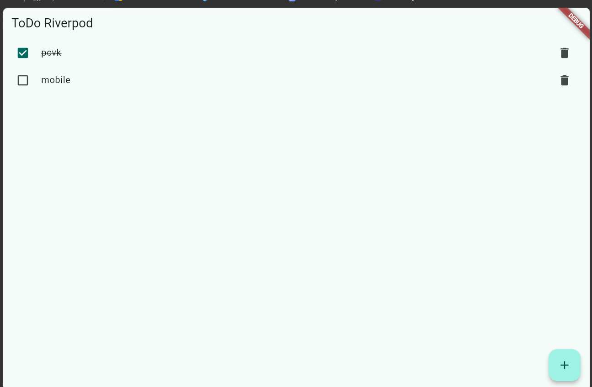
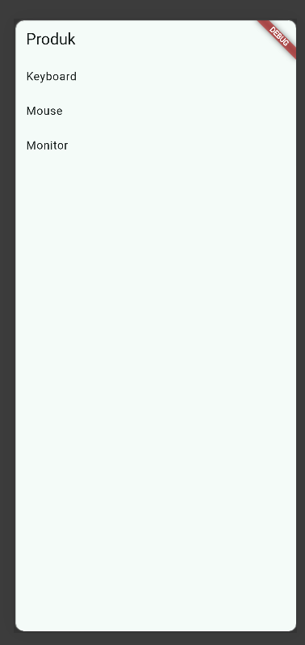
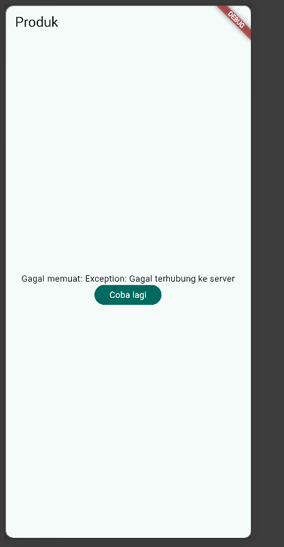
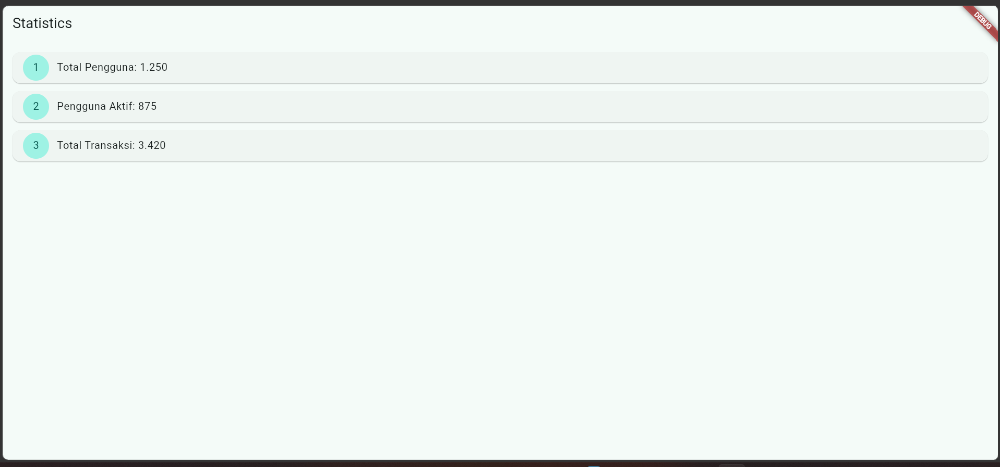
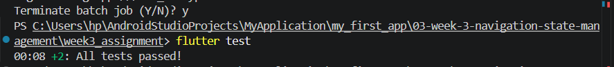

# 03 | Navigation & State Management

## 2. Konsep navigasi dan GoRouter

## 3. State management dengan Riverpod

## 4. AsyncValue: loading, error, success

### Praktikum 3 — Uji ketiga state

- terkadang lebih baik menampilkan stale dengan indikator refresh daripada mengosongkan layar karena pengguna masih dapat melihat data yang sebelumnya sudah tersedia saat aplikasi sedang mengambil data terbaru. Hal tersebut membuat aplikasi terasa lebih cepat dan memberikan pengalaman pengguna yang lebih baik karena tidak menampilkan layar kosong.

- pola ini penting untuk aplikasi e-commerce, berita, media sosial, dan dashboard yan datany dapat diperbarui secara berkala. Namun, stale data tidak selalu cocok untuk informasi yang sangat sensitif terhadap waktu. Pada kondisi tersebut, data lama dapat menyesatkan pengguna sehingga aplikasi perlu memberikan indokator yang jelas atau menunggu data terbaru sebelum menampilkannya.

## 5. AI Challenge

#### AI Verification Checklist
## Hasil Verifikasi Checklist

| No. | Item | Status | Bukti |
|---:|---|:---:|---|
| 1 | **State immutable** | ✅ | `stats_notifier.dart:49-53` — Mengembalikan list literal baru setiap kali, tidak ada `state.add()` atau mutasi langsung. |
| 2 | **`ref.watch` di `build()`, `ref.read` di callback** | ✅ | `stats_page.dart:17` → `ref.watch` di `build()` dan `stats_page.dart:78` → `ref.read` di callback `onPressed`. |
| 3 | **Ketiga `AsyncValue` ditangani** | ✅ | `stats_page.dart:29` → `.when(loading:, error:, data:)` — ketiga kondisi sudah ditangani. |
| 4 | **Tipe eksplisit, tidak duplikat** | ✅ | `stats_notifier.dart:11-12` → `AsyncNotifierProvider<StatsNotifier, List<String>>`. Hanya terdapat 1 provider di seluruh project. |
| 5 | **Tidak memakai API versi lama** | ✅ | Tidak terdapat `StateProvider`, `StateNotifierProvider`, atau `Consumer` bertingkat. Menggunakan `AsyncNotifierProvider` + `ConsumerWidget`. |
| 6 | **`flutter analyze` & `flutter test`** | ⚠️ Perlu dijalankan | Sebelumnya proses dihentikan/di-abort, sehingga perlu menjalankan ulang `flutter analyze` dan `flutter test` untuk memastikan hasil akhir. |

#### Checklist verifikasi mandiri
- Navigasi GoRouter bekerja: pindah halaman, back, dan akses path detail langsung.     ✅
- ProviderScope membungkus root aplikasi; state ToDo bertahan saat berpindah halaman.     ✅
- UI AsyncValue menangani loading, error, dan success, bukan hanya success.             ✅
- flutter analyze tanpa issue dan semua test lulus.                                    ✅
- Hasil AI diverifikasi dan didokumentasikan pada folder docs/.                        ✅

#### Refleksi
1. Kapan setState masih cukup, dan kapan state harus naik ke Riverpod?
**setState cukup untuk state sederhana dalam satu widget. Riverpod digunakan jika state perlu dibagikan ke beberapa widget/halaman atau memiliki logika yang lebih kompleks.
2. Apa perbedaan context.go dan context.push, dan kapan masing-masing tepat digunakan?
3. Bagaimana AsyncValue mencegah bug dibanding tiga boolean terpisah?
4. Bagian mana dari hasil AI yang Anda perbaiki, dan mengapa?