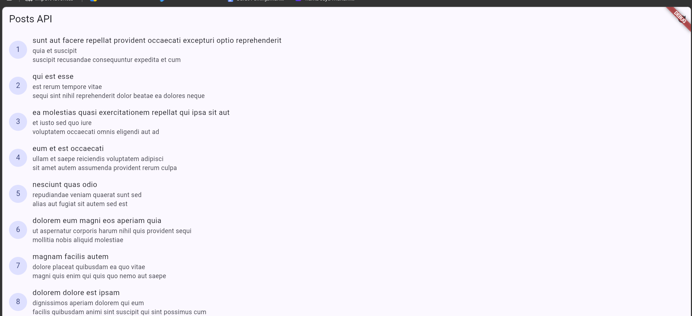
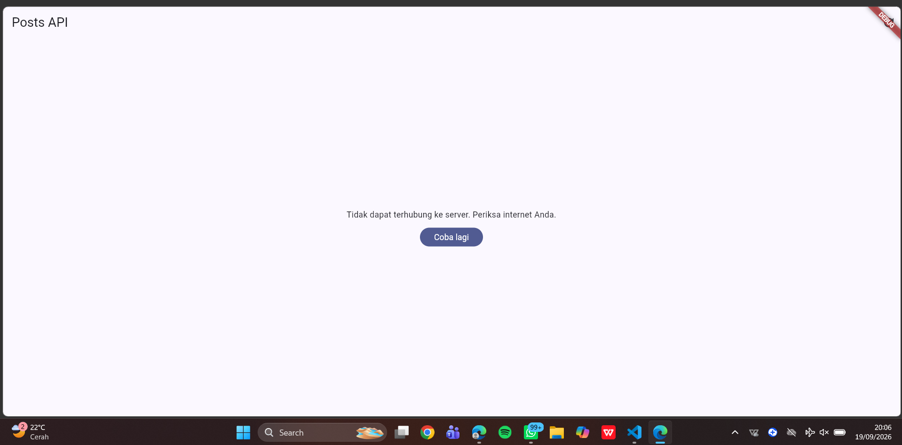
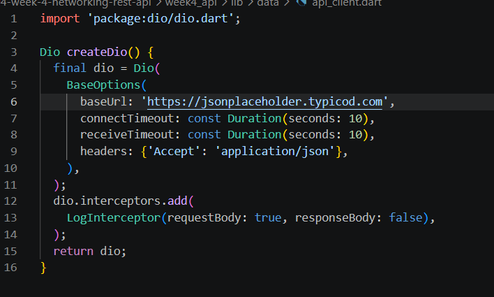
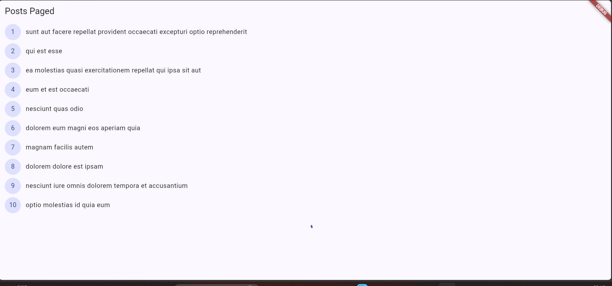
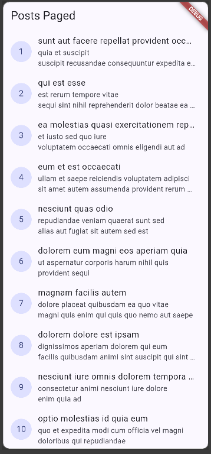
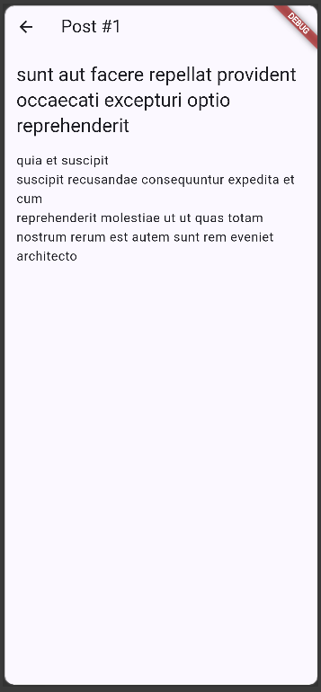

# 04 | Networking & REST API
## 3. Praktikum 1: Dio dan model data

## 4. Praktikum 2: Provider dan error handling
1. 
2. 
3. 
 

## 5. Praktikum 3: Pagination dasar

## 6. AI Challenge
### AI Prompt Challenge
**Minta AI coding assistant (Cursor, Copilot, Claude Code, atau tool setara) dengan prompt berikut:**

Buatkan repository layer Flutter untuk endpoint GET /comments?postId={id} dari JSONPlaceholder menggunakan Dio + flutter_riverpod.
Requirements:
- Model Comment dengan fromJson aman null (postId, id, name, email, body).
- CommentRepository dengan method fetchComments(postId) + timeout 10 detik.
- AsyncNotifierProvider dengan penanganan error otomatis (AsyncError) dan fungsi pesan error ramah pengguna untuk timeout, connection error, 404, dan 500.
- Satu unit test untuk fromJson dengan field yang hilang.
Jelaskan setiap bagian kode dalam komentar.

| No. | Checklist                                   | Status | Keterangan                      |
| --: | ------------------------------------------- | :----: | ------------------------------- |
|   1 | UI tidak memanggil Dio langsung             |    ✅   | Dio di Repository               |
|   2 | `fromJson` aman terhadap `null` & tipe data |    ✅   | Validasi tipe sudah ditambahkan |
|   3 | Penanganan `DioExceptionType`               |    ✅   | Semua error utama ditangani     |
|   4 | `baseUrl` & timeout terpusat                |    ✅   | Menggunakan konstanta           |
|   5 | Unit test field hilang & tipe salah         |    ✅   | Edge case sudah diuji           |
|   6 | Analyze & unit test                         |    ✅   | 0 issue, semua test passed      |

## Refactoring dan testing

| No. | Item                            | Status |
| --: | ------------------------------- | :----: |
|   1 | UI tidak memanggil Dio langsung |    ✅   |
|   2 | 4 state UI                      |   ✅   |
|   3 | Pagination aman                 |   ✅   |
|   4 | Analyze & test                  |    ✅   |
|   5 | Dokumentasi AI                  |    ✅   |
