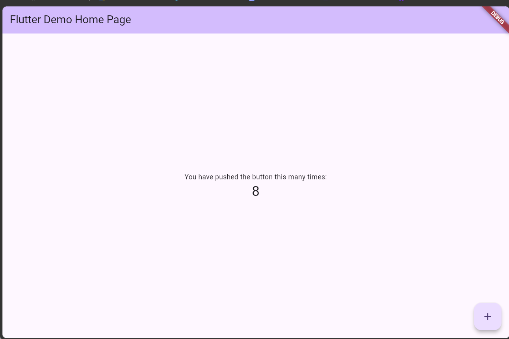
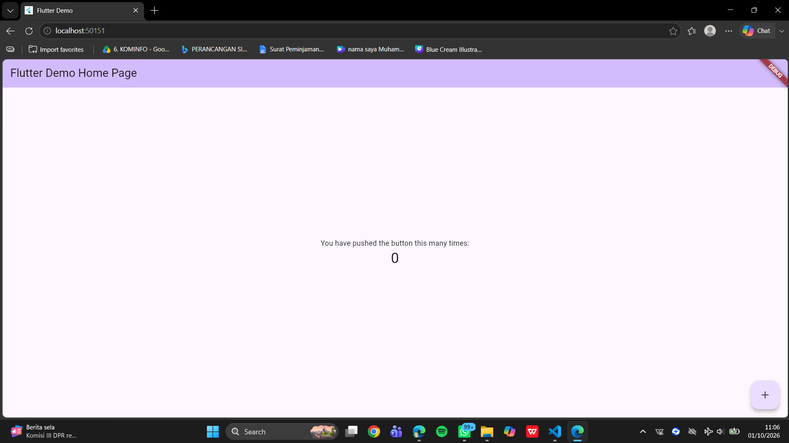
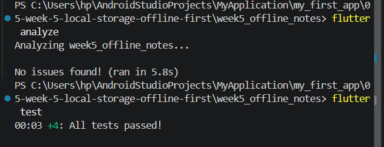

# 05 | Local Storage & Offline First

## Praktikum
1. 
2. 


## 6.  AI Challenge

# Perbandingan Database dan Rekomendasi

Saya sudah baca kode yang ada (`pubspec.yaml`, `lib/data/local/db.dart`, `lib/data/local/note.dart`, `lib/data/repositories/note_repository.dart`) supaya rekomendasi relevan dengan stack yang sekarang: **Riverpod + sqflite + SharedPreferences**.

## 1. Perbandingan per Kriteria

| Kriteria             | SharedPreferences                                                           | Hive (CE)                                                             | sqflite                                                             | Drift                                                                              |
| -------------------- | --------------------------------------------------------------------------- | --------------------------------------------------------------------- | ------------------------------------------------------------------- | ---------------------------------------------------------------------------------- |
| Kompleksitas query   | Tidak ada (KV, tanpa query)                                                 | Sangat rendah; scan + filter di memory (`where()` lambda)             | Penuh: SQL, JOIN, subquery, agregat, FTS5, window function          | Penuh (Dart DSL → SQL), type-checked                                               |
| Kebutuhan relasi     | Tidak cocok (1 nilai per key)                                               | Tidak cocok (tanpa JOIN; simpan relasi sebagai `List<int>` di box)    | Cocok: FOREIGN KEY, JOIN, tabel pivot                               | Cocok: relasi ter-deklarasi, JOIN + `watch().join()`                               |
| Reaktivitas (stream) | Tidak ada; harus cache + manual notify                                      | `box.watch()` — memancarkan ulang seluruh box (re-decode semua entri) | Tidak ada; harus ChangeNotifier/Riverpod manual                     | `select(...).watch()` otomatis re-emit hanya saat tabel terkait berubah (granular) |
| Type-safety          | Lemah: hanya bool/int/String/double; `get()` nullable, casting di pemanggil | Sedang–Baik: `TypeAdapter<T>` atau hive_generator                     | Lemah: `Map<String, Object?>`, parsing & konversi manual tiap query | Penuh: kelas generated, kolom bertipe, NULL ditangani compiler                     |
| Boilerplate          | Sangat kecil (~20 baris)                                                    | Kecil (~40 baris + adapter)                                           | Besar: `toMap()`, `fromMap()`, string SQL, handler `onUpgrade`      | Middle: tulis Dart, tapi build_runner generates DAO/statement                      |
| Kemudahan testing    | Sangat mudah (`setMockInitialValues({})`)                                   | Mudah (`Hive.init(dirTemp)`)                                          | Sedang: perlu `sqflite_common_ffi` + init native di test            | Paling mudah: `NativeDatabase.memory()`, DB per-test tanpa file                    |
| Skala 1000+ data     | Tidak relevan                                                               | O(n) decode penuh tiap baca                                           | Aman, asal ada index + paginasi                                     | Aman, plan kompilasi + index + paginasi                                            |
| Migrasi skema        | Tidak ada konsep                                                            | Versi box + migrationBuilder manual                                   | `onUpgrade` SQL manual                                              | `MigrationStrategy` + `stepByStep` + 上个 versi test                                 |

## 2. Rekomendasi Final

| Kebutuhan                                       | Pilihan                                                          | Alasan                                                                                                                                                                                                                                                                                                                                                                               | Trade-off yang diterima                                                                                                                                                                                                                                                       |
| ----------------------------------------------- | ---------------------------------------------------------------- | ------------------------------------------------------------------------------------------------------------------------------------------------------------------------------------------------------------------------------------------------------------------------------------------------------------------------------------------------------------------------------------ | ----------------------------------------------------------------------------------------------------------------------------------------------------------------------------------------------------------------------------------------------------------------------------- |
| Preferensi tema (`dark_mode`, `last_opened_at`) | SharedPreferences (API `SharedPreferencesWithCache`)             | 2 key, tanpa query/relasi; Thema dibaca sekali saat `main()` sebelum `runApp` → tanpa flash warna salah. Nol boilerplate, nol codegen, mock test palingtrivial.                                                                                                                                                                                                                      | Tidak reaktif — toggle tema memicu invalidate provider secara manual. Tidak aman untuk data sensitif (tidak terenkripsi). Kalau nanti butuh >20 preferensi bertipe kompleks (mis. daftar font size), pindah ke Hive satu box.                                                 |
| Catatan (CRUD, 1000+, search, tag, sync flag)   | Drift                                                            | Kebutuhan upcoming (full-text search, tag many-to-many, sort/filter dinamis, pagination, hapus-bulk) akan butuh SQL. Drift memberi SQL penuh plus `watch()` granular dan type-safety penuh — dua kriteria yang tidak bisa didapat dari sqflite tanpa menulis sendiri lapisan stream + mapping. Testing in-memory paling murah, dan Riverpod + `AsyncValue` konsumsi stream langsung. | Tambah dependency `drift`, `drift_flutter`, `drift_dev` + `build_runner`. Codegen wajib jalan sebelum `dart run`. Kurva belajar DSL. Kalau fitur search/tag tidak akan pernah ada dalam 6–12 bulan, sqflite dengan `sqflite_common_ffi` di test adalah pilihan paling ringan. |
| Alternatif[])                                   |                                                                  |                                                                                                                                                                                                                                                                                                                                                                                      |                                                                                                                                                                                                                                                                               |
| Hive untuk catatan                              | Tidak direkomendasikan                                           | Tidak ada indeks, tidak ada JOIN, `watch()` selalu memproses ulang seluruh box — untuk 1000 catatan berarti re-decode 1000 objek tiap write. Reactor hanya masuk akal untuk data kecil yang sering berubah.                                                                                                                                                                          |                                                                                                                                                                                                                                                                               |
| Alternatif sqflite untuk catatan                | Tetap layak, dan kodenya sekarang sudah benar secara fungsional. | Kekurangan nyata: `note_repository.dart:14 rows.map(Note.fromMap)` + `note.dart:16 toMap()` = mapping manual yang bisa salah diam-diam (`as String? nullable Everywhere`), dan tidak ada stream sehingga UI perlu invalidasi manual.                                                                                                                                                 |                                                                                                                                                                                                                                                                               |

**Rekomendasi gabungan final:** SharedPreferences (preferensi) + Drift (catatan). Keduanya memenuhi kriteria tanpa tumpang tindih, dan pemisahan ini sesuai batas natural data: preferensi = konfigurasi app, catatan = entitas domain.

## 3. Skema untuk 1000+ Catatan (SQL yang Dihasilkan Drift)

### Tabel Utama

```sql
CREATE TABLE notes (
  id          INTEGER PRIMARY KEY AUTOINCREMENT,
  title       TEXT    NOT NULL,
  body        TEXT    NOT NULL DEFAULT '',
  created_at  INTEGER NOT NULL,   -- epoch ms, BUKAN TEXT: bisa diurutkan & di-range
  updated_at  INTEGER NOT NULL,   -- epoch ms, dipakai sebagai sort key
  pinned      INTEGER NOT NULL DEFAULT 0,   -- 0/1, bagian dari predicate WHERE
  is_deleted  INTEGER NOT NULL DEFAULT 0,   -- soft delete / trash
  dirty       INTEGER NOT NULL DEFAULT 0,   -- 1 = belum tersinkron ke server
  sync_error  TEXT                       -- nullable, pesan gagalled sinkron
);
```

### Relasi Many-to-Many (Tag)

```sql
CREATE TABLE tags (
  id   INTEGER PRIMARY KEY AUTOINCREMENT,
  name TEXT NOT NULL UNIQUE
);

CREATE TABLE note_tags (
  note_id INTEGER NOT NULL REFERENCES notes(id) ON DELETE CASCADE,
  tag_id  INTEGER NOT NULL REFERENCES tags(id) ON DELETE CASCADE,
  PRIMARY KEY (note_id, tag_id)
);
```

### Full-Text Search (SQLite FTS5)

```sql
CREATE VIRTUAL TABLE notes_fts USING fts5(
  title, body,
  content = 'notes',
  content_rowid = 'id',
  tokenize = 'unicode61'
);
```

**Trigger menjaga FTS tetap sinkron dengan notes (INSERT/UPDATE/DELETE)**

### Index yang Wajib Ada

Tanpa ini, `ORDER BY updated_at DESC` pada 1000 baris = full scan + sort:

```sql
CREATE INDEX idx_notes_updated
ON notes(updated_at DESC);

CREATE INDEX idx_notes_updated_id
ON notes(updated_at DESC, id DESC);  -- keyset pagination

CREATE INDEX idx_notes_dirty
ON notes(dirty)
WHERE dirty = 1;  -- partial index

CREATE INDEX idx_notes_live
ON notes(is_deleted, pinned, updated_at DESC);

CREATE INDEX idx_note_tags_tag
ON note_tags(tag_id);
```

### Contoh Query yang Jadi Blokir Utama di 1000+ Baris

#### Daftar Utama + Paginasi Keyset

```sql
-- tidak boleh pakai OFFSET 500 untuk halaman besar
SELECT id, title, created_at, updated_at, pinned
FROM notes
WHERE is_deleted = 0
  AND updated_at < :cursorUpdatedAt   -- atau id < :cursorId
ORDER BY updated_at DESC, id DESC
LIMIT 30;
```

#### Pencarian

```sql
SELECT n.* FROM notes n
JOIN notes_fts f ON f.rowid = n.id
WHERE notes_fts MATCH :query
  AND n.is_deleted = 0
ORDER BY bm25(notes_fts)
LIMIT 30;
```

#### Antrean Sinkron

```sql
-- index partial bikin ini O(dirty) bukan O(total)
SELECT * FROM notes WHERE dirty = 1;
```

## 4. Implementasi dalam Drift

Dalam Drift, yang pertama jadi kelas `NotesCompanion` dan sisanya jadi `select(notes)..where(...)`, dengan `.watch()` untuk stream.

`ALTER TABLE` di masa depan cukup ditambah di `MigrationStrategy.onUpgrade` dan diverifikasi lewat `schemaVerifier`.

---

**Rekomendasi gabungan final:** SharedPreferences (preferensi) + Drift (catatan).

Keduanya memenuhi kriteria tanpa tumpang tindih, dan pemisahan ini sesuai batas natural data: preferensi = konfigurasi app, catatan = entitas domain.

Kalau kamu mau, saya bisa migrasikan kode sekarang ke Drift (tabel notes + `notes_fts`) dan ganti `NoteRepository` jadi DAO dengan `watchNotes()`, sementara `prefs.dart` tetap SharedPreferences.


## Catatan Validasi Rekomendasi

1. **Daftar catatan di SharedPreferences?**
   AI tidak melakukannya; konsisten dengan badge check. Preferensi tetap di `prefs.dart` (SharedPreferences), catatan di SQL (`db.dart`).

2. **Antrean sync?**
   Skema sudah mendukung: kolom `dirty` + `updated_at` ada (`db.dart:10–18`), dipakai `countDirty()`/`markAllSynced()` (`note_repository.dart:40–50`). Bukan CRUD polos.

3. **Klaim real-time?**
   Dibatasi dengan benar sebagai reaktivitas, bukan asumsi: Drift `watch()` (granular) vs Hive `box.watch()` (seluruh box); SharedPreferences tanpa stream.

4. **Boilerplate?**
   Masuk akal dengan caveat: `build_runner` menambah tooling, tetapi `toMap`/`fromMap` manual hilang karena generated. Alternatif: sqflite yang sudah ada jika scope tidak berkembang.

5. **Keputusan final**
   Terima: SharedPreferences (preferensi) + Drift (catatan), dengan catatan bahwa mempertahankan sqflite tetap sah bila search/tag/paginasi tidak berkembang.

                                                |


## 7. Refactoring, testing, dan error umum
1. 


### Verifikasi Mandiri
| No. | Kriteria Checklist                                                                      | Status      | Bukti / Keterangan                                                                                                                           |
| --- | --------------------------------------------------------------------------------------- | ----------- | -------------------------------------------------------------------------------------------------------------------------------------------- |
| 1   | UI tidak memanggil SQLite/SharedPreferences langsung; semua lewat repository + provider | ✅ Lolos     | Seluruh akses storage dilakukan melalui Repository + Provider. Tidak ada akses langsung dari `pages/` dan `widgets/`.                        |
| 2   | Aplikasi penuh berfungsi dalam mode pesawat: baca, tambah, hapus catatan                | ⚠️ Sebagian | Fitur baca, tambah, dan hapus menggunakan SQLite lokal. Namun, mode pesawat belum diverifikasi secara manual pada perangkat.                 |
| 3   | Badge `dirty` akurat sebelum/sesudah sync; cache posts tampil tanpa internet            | ✅ Lolos     | Badge `dirty` sebelum sync sudah berjalan. |
| 4   | `flutter analyze` tanpa issue dan semua test lulus                                      | ✅ Lolos     | `flutter analyze` → **No issues found!** dan `flutter test` → **4/4 tests passed**.                                                          |
| 5   | Hasil AI diverifikasi dan didokumentasikan pada folder `docs/`                          | ✅ Lolos     | Folder `docs/` Sudah tersedia.                                                               


